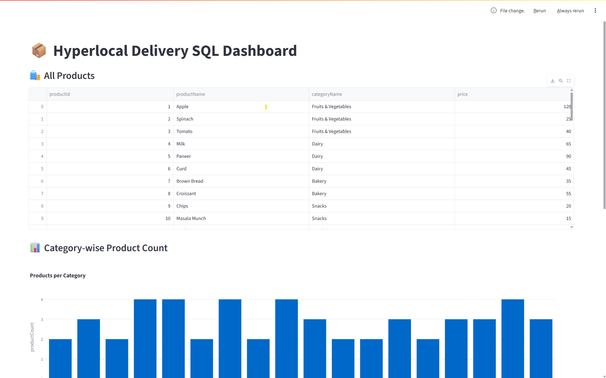
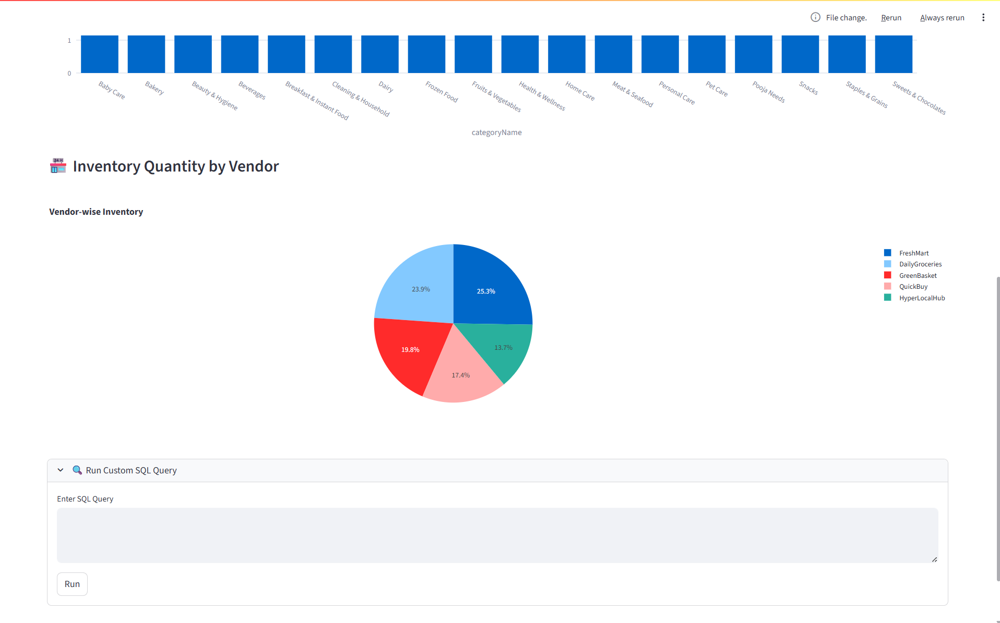
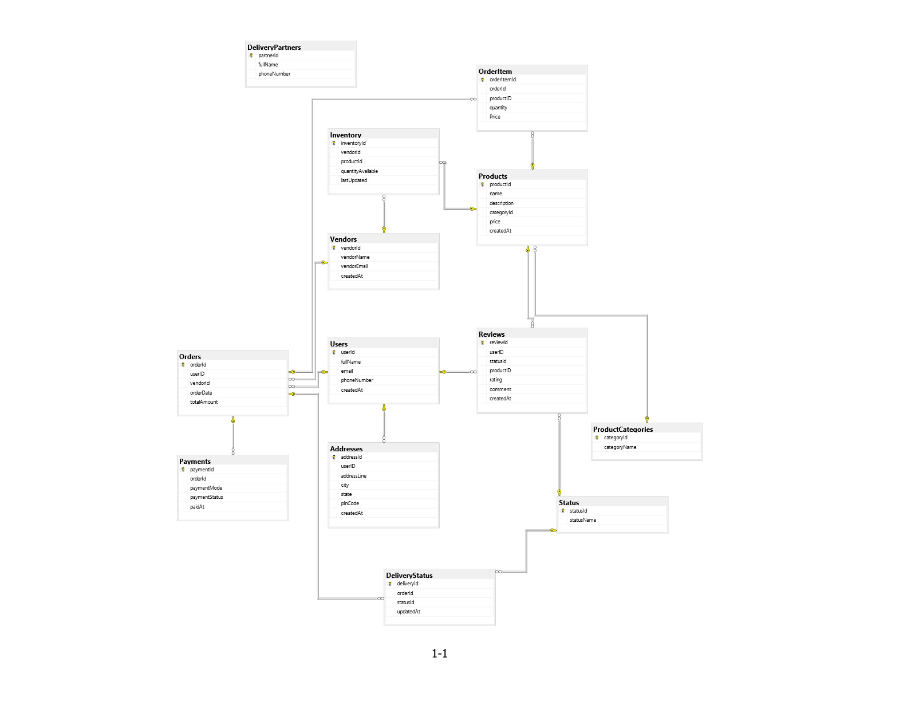

# 📦 Hyperlocal Delivery Platform Database – Full SQL Server Project

This repository showcases a complete SQL-based backend architecture for a **Hyperlocal Delivery System**, inspired by real-world platforms such as **Zepto**, **Dunzo**, and **Blinkit**.

---

## 🎯 Objectives

- Design a scalable and normalized database structure  
- Insert real-world sample data (users, vendors, products, orders)  
- Write powerful SQL queries for business analytics  
- Create Views, Indexes, Triggers, and Stored Procedures  
- Optimize database performance  
- Implement Role-Based Access Control (RBAC)  
- Automate daily tasks with SQL Server Agent Jobs  
- Send scheduled notifications (like Zomato reminders)  
- Build an optional frontend using Python and Streamlit for live data interaction

---

## 🏗️ Database Modules

| Module               | Purpose                                             |
|----------------------|------------------------------------------------------|
| Users & Addresses    | Manage user profiles and delivery addresses          |
| Vendors & Inventory  | Track store stock levels                             |
| Products & Categories| Organize product listings                            |
| Orders & OrderItems  | Handle order creation and tracking                   |
| Payments             | Manage payment modes and statuses                    |
| Delivery Tracking    | Assign and track delivery partners and status        |
| Reviews              | Collect product and vendor feedback                  |
| Status Management    | Standardize delivery statuses                        |
| Notifications        | Send scheduled marketing reminders                   |

---
## 🖼️ Application Screenshots

---
## 📊 Entity-Relationship Diagram (ERD)

---

## 🚀 Features

- Production-level SQL scripts covering all critical modules  
- Fully normalized schema with referential integrity  
- 100+ realistic records for simulation and testing  
- Views and stored procedures for modularity and reuse  
- Real-time stock management using triggers  
- Daily order summaries via SQL Server Agent  
- Role-based access and data protection  
- Supports optional frontend dashboard integration using Streamlit for interactive queries and analytics

---

This project can serve as a backend model for scalable delivery-based platforms and can be easily extended into a full-stack prototype by integrating it with a frontend dashboard.
